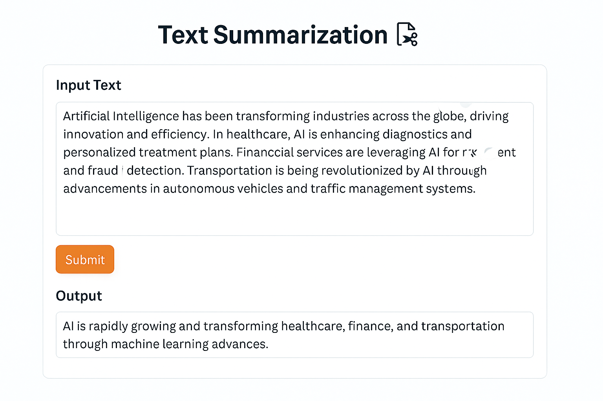

# Text Summarization App 📄✂️

A web-based text summarization tool that uses state-of-the-art NLP models to generate concise summaries from long-form text. Built with Gradio and deployed on Hugging Face Spaces.



## 🚀 Live Demo

Try the app: [text-summarization](https://huggingface.co/spaces/ashish-soni08/Text-Summarizer)

## ✨ Features

- **Instant Summarization**: Generate concise summaries from lengthy text in seconds
- **Clean Interface**: Intuitive web UI built with Gradio
- **Pre-trained Model**: Uses DistilBART-CNN for high-quality summarization
- **Responsive Design**: Works on desktop and mobile devices

## 🛠️ Technology Stack

- **Backend**: Python, Hugging Face Transformers
- **Frontend**: Gradio
- **Model**: [DistilBART-CNN-12-6](https://huggingface.co/sshleifer/distilbart-cnn-12-6)
- **Deployment**: Hugging Face Spaces

## 🏃‍♂️ Quick Start

### Prerequisites

```bash
Python 3.8+
```

### Installation

1. Clone the repository:
```bash
git clone https://github.com/yourusername/text-summarization-app.git
cd text-summarization-app
```

2. Install dependencies:
```bash
pip install -r requirements.txt
```

3. Run the application:
```bash
python app.py
```

4. Open your browser and navigate to `http://localhost:7860`

## 📋 Usage

1. **Input Text**: Paste or type the text you want to summarize in the input box
2. **Generate Summary**: Click the "Submit" button
3. **View Results**: The summarized text will appear in the output section

### Example

**Input:**
```
Artificial Intelligence has been transforming industries across the globe...
[Your example text here]
```

**Output:**
```
AI is rapidly growing and transforming healthcare, finance, and transportation through machine learning advances.
```

## 🧠 Model Information

This app uses DistilBART-CNN-12-6 (sshleifer/distilbart-cnn-12-6), a distilled version of Facebook's BART model:

- Architecture: 12-layer encoder, 6-layer decoder transformer
- Parameters: ~306 million parameters
- Training Data: CNN/Daily Mail dataset
- Performance: Rouge-2: 21.26, Rouge-L: 30.59
- Speed: ~1.24x faster than full BART-large while maintaining competitive quality

## 📁 Project Structure

```
text-summarization-app/
├── app.py                 # Main Gradio application
├── requirements.txt       # Python dependencies
├── README.md             # Project documentation
```

## 📄 License

This project is licensed under the AFL-3.0 License - see the [LICENSE](LICENSE) file for details.

## 🙏 Acknowledgments

- [Hugging Face](https://huggingface.co/) for the Transformers library and model hosting
- [Gradio](https://gradio.app/) for the web interface framework
- Original BART paper authors for the foundational research

## 📞 Contact

Ashish Soni - ashish.soni2091@gmail.com

Project Link: [text-summarization](https://github.com/Ashish-Soni08/text-summarization-app)
